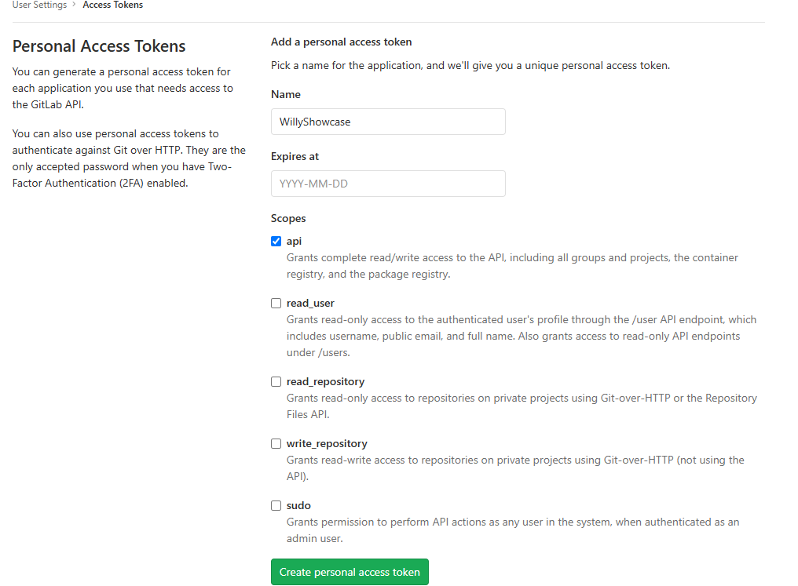

# Cypress Automation Project — GUI + API Testing

This Cypress project is an E2E and API testing strategy. Built with JavaScript, it utilizes Custom Commands and App Actions for faster execution and easier maintenance. Key highlights include optimized test cycles via cy.session, environment setup through API requests for total test isolation, and a  selector strategy using data-qa-selector. Integrated with Faker.js for dynamic data and Docker for containerization, the suite is engineered for consistent execution within any CI/CD pipeline.

---

## About the Project

This automation suite tests a free self-hosted version of **GitLab CE**, running locally via Docker.

Key features:

- Uses **Docker** to run GitLab CE locally
- Covers **GUI and API** testing
- Restores and reuses login sessions
- Use the Custom Commands model for reutilization


---

## ⚙️ Prerequisites

Make sure the following tools are installed on your system:

1. [Git Bash](https://git-scm.com/)
2. [Docker](https://www.docker.com/)
3. [Node.js (LTS)](https://nodejs.org/)

---

## 🚀 How to Set Up & Run

### 1. Clone the Repository

```bash
git clone https://github.com/willypess/cypress-gitlab-tests.git
````

### 2. Run GitLab CE via Docker

```bash
docker run --detach --publish 80:80 --publish 22:22 --hostname localhost  wlsf82/gitlab-ce
```

### 3. Install Cypress and Dependencies

```bash
npm install --save-dev cypress-plugin-api
```

---

## 🐳 Docker GitLab Setup

1. Open your browser and go to: [http://localhost](http://localhost)
2. Set the root password to: `root1234`
3. Register a new account
4. Go to **User Settings → Access Tokens**
5. In the “Name” field, type `WillyShowcase`, then click **Create**
6. Save the generated **Personal Access Token**



6. Add the token to your `cypress.env.json` file in this format:

```json
{
  "gitlab_token": "your_token_here"
}
```

7. Run Cypress:

```bash
npx cypress open
```


